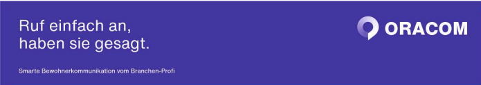

# Oracom GmbH

Oracom GmbH is a leading provider of communication solutions across Germany, offering reliable and quality-driven services tailored for the real estate industry. As a proud member of the BERBUS ALLIANCE, we contribute to the collective success of our partners and clients alike.

## Our Mission
We are dedicated to delivering services that stand for:

Customer Orientation – Putting our clients at the forefront of everything we do.
Growth with Stability – Ensuring calm, sustained growth for our clients.
Long-Term Commitment – Building lasting relationships.
Reliability – Being a dependable partner.
Quality Management – Upholding the highest standards of service.
Our Vision
Oracom currently manages communication services for approximately 500,000 residential units across Germany. Our long-term vision is to expand this reach to serve 5,000,000 units, delivering unmatched expertise and tailored communication solutions.

## Core Values

Sustainability – Emphasizing environmental and social responsibility in all actions.
Teamwork and Trust – Working collaboratively with a culture of openness and mutual respect.
Excellence in Execution – Meeting expectations with a commitment to fulfilling tasks thoroughly and promptly.
Respect and Courtesy – Remaining polite and accommodating in all situations.
Why Oracom?
Our employees are our greatest asset. We foster an inclusive environment that respects individuality and promotes personal and professional growth. We believe in open communication and trust, ensuring that every team member feels valued and empowered.

